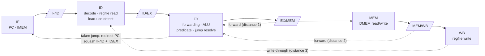

# Pipelined Predicated RISC-32 Processor


This is a 32-bit RISC processor with a **classic 5-stage pipeline** (IF → ID → EX → MEM → WB), written in Verilog. Every instruction is **predicated**: it names a predicate register `Rp` and only takes effect if `Reg[Rp] ≠ 0`. That lets short `if` blocks run without branches.

The pipeline resolves data hazards with **full forwarding**, **load-use stalls** and a **write-through register file**. Control hazards are handled by **squashing** the wrong-path instructions behind a taken jump. A self-checking testbench covers every instruction and each hazard case.

---

## Pipeline



| Hazard | How it is handled |
|---|---|
| RAW, distance 1–2 | Forwarding from EX/MEM and MEM/WB into EX. **The newest producer wins.** Producers whose predicate was false are **not** forwarded. |
| RAW, distance 3 | The register file passes the value being written back straight through to the ID-stage read ports. |
| Load-use | A 1-cycle stall (PC and IF/ID hold, ID/EX gets a bubble). This covers `Rs`, `Rt`, store data **and the predicate register**. |
| Predicate dependencies | The predicate is evaluated **in EX, after forwarding**, so an instruction can use a predicate computed by the instruction right before it. |
| Control (J / CALL / JR) | Resolved in EX. The two wrong-path instructions (in IF and ID) are squashed, so a taken jump costs 2 cycles. |
| CALL → R31 | The link value (PC + 1) travels in the ALU-result slot, so a function body can read `R31` right away through forwarding. |

## ISA

| | Format (bit fields) |
|---|---|
| **R-type** | `opcode[31:27] · Rp[26:22] · Rd[21:17] · Rs[16:12] · Rt[11:7] · unused[6:0]` |
| **I-type** | `opcode[31:27] · Rp[26:22] · Rd[21:17] · Rs[16:12] · imm12[11:0]` |
| **J-type** | `opcode[31:27] · Rp[26:22] · offset22[21:0]` |

| Op | Instruction | Semantics (if `Reg[Rp] ≠ 0`) |
|---:|---|---|
| 0 | `ADD Rd, Rs, Rt` | `Rd = Rs + Rt` |
| 1 | `SUB Rd, Rs, Rt` | `Rd = Rs − Rt` |
| 2 | `OR Rd, Rs, Rt` | `Rd = Rs \| Rt` |
| 3 | `NOR Rd, Rs, Rt` | `Rd = ~(Rs \| Rt)` |
| 4 | `AND Rd, Rs, Rt` | `Rd = Rs & Rt` |
| 5 | `ADDI Rd, Rs, imm` | `Rd = Rs + sext(imm)` |
| 6 | `ORI Rd, Rs, imm` | `Rd = Rs \| zext(imm)` |
| 7 | `NORI Rd, Rs, imm` | `Rd = ~(Rs \| zext(imm))` |
| 9 | `ANDI Rd, Rs, imm` | `Rd = Rs & zext(imm)` |
| 10 | `LW Rd, imm(Rs)` | `Rd = Mem[Rs + sext(imm)]` |
| 11 | `SW Rd, imm(Rs)` | `Mem[Rs + sext(imm)] = Rd` |
| 12 | `J offset` | `PC = PC + sext(offset)` |
| 13 | `CALL offset` | `R31 = PC + 1; PC = PC + sext(offset)` |
| 14 | `JR Rs` | `PC = Rs` |

**Register conventions:** `R0` is hardwired to 0. `R30` reads as the PC. `R31` is the return-address register. Setting `Rp = R0` means "execute unconditionally". Instruction and data memories are separate (Harvard) and word-addressed.

---

## Verification

[`tb/tb_selfcheck.sv`](tb/tb_selfcheck.sv) loads a 32-instruction program ([`programs/test_program.asm`](programs/test_program.asm)) with **no NOP padding**, so every hazard actually occurs. After the run it checks the architectural state:

```
ok    ADD, forwarding from EX/MEM and MEM/WB       R3 = 12
ok    SUB, same-cycle writeback bypass             R4 = 7
ok    forwarding picks the newest producer         R21 = 2
ok    load-use stall                               R9 = 17
ok    predicate false skips, true executes         R13 = 77
ok    predicated-off result is not forwarded       R22 = 77
ok    predicate produced by a load                 R24 = 9
ok    taken J squashes both wrong-path slots       R14 = 0
ok    R31 forwarded right after CALL               R18 = 27
ok    JR returns to caller                         R16 = 88
...                                                (20 checks)
PASS: all checks succeeded
```

### Run it

```bash
cd sim
vsim -c -do run.do          # Questa / ModelSim
```

To run your own program, write 32-bit hex words (one per line) and convert them to the byte-per-line format that the instruction memory loads:

```bash
python tools/format.py programs/test_program.hex sim/memfile.dat
```

## Repository layout

```
rtl/
  datapath.v           5-stage pipeline, forwarding, hazard unit, predicate logic
  controller.v         opcode → control signals (combinational)
  basic_components.v   ALU, register file (write-through), sign/zero extenders
  memories.v           instruction + data memories (word-addressed, little-endian)
  processor.v, top.v   CPU wrapper and top level with memories
  opcodes.v            opcode + ALU-control definitions
tb/
  tb_selfcheck.sv      self-checking testbench (20 checks)
  tb.v                 free-running testbench (loads sim/memfile.dat)
programs/              test program as assembly and hex
tools/format.py        hex → memfile.dat converter
sim/run.do             Questa/ModelSim script
```

---

## Post-course fixes

The first commit is the design as it was at the end of the course. When I later wrote the stricter testbench above (no NOP padding), **7 of the 20 checks failed**. The second commit fixes these issues:

| Issue | Symptom | Fix |
|---|---|---|
| Register-file reads went through a function call, so the `assign` was only sensitive to the read address | Stale values after writeback (distance 3, and R31 after CALL) | Explicit continuous expressions, plus write-through bypass |
| MEM/WB forwarding was checked *after* EX/MEM | An older value overwrote the newer one | Reordered so EX/MEM (newest) takes priority |
| Predicate read in ID with no forwarding | A predicate set 1–2 instructions earlier was read as stale | Predicate evaluated in EX with forwarding; load-use detection extended to `Rp` |
| Forwarding ignored the producer's predicate | A skipped instruction's result could be forwarded | Forwarding gated on `EXMEM_pred` / `MEMWB_pred` |
| Taken jump flushed only IF/ID | The instruction right after a jump still executed | ID/EX is also bubbled on a taken jump |
| Opcodes from ANDI onward were off by one versus the spec | Binaries built for the spec decoded wrongly | Opcodes renumbered to match the spec (ANDI = 9 … JR = 14) |
| `dmem` wrote through a variable that was also driven by `always_comb` | Rejected by Questa's optimiser (vopt-7033) | Separate write address expression |

---

*Team project (3 students), Computer Architecture (ENCS4370), Birzeit University, Fall 2025/26.*
